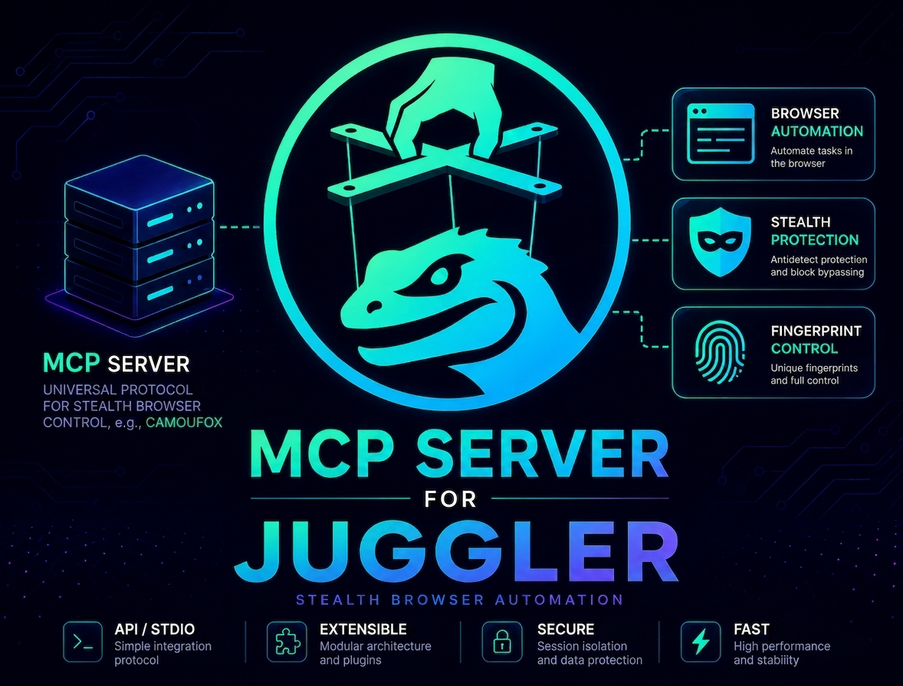

# go-juggler-mcp



[](go.mod)
[](LICENSE)
[](https://modelcontextprotocol.io)
[](#support)

An MCP-compatible server that lets you control a browser programmatically via
the [Juggler](https://github.com/yvv4git/go-juggler) protocol. It exposes
browser automation as MCP tools, so any MCP client (opencode, Claude Desktop,
Cursor, etc.) can open tabs, inspect pages, click, type and take screenshots.

## Key features

- **19 MCP tools** for browser automation: navigation, ARIA snapshots,
  clicking, typing, scrolling, JS evaluation and network analysis
- **Zero-config startup** — session keys are auto-generated
- **Flexible transport** — stdio (default) or streamable HTTP
- **Screenshot control** — return to a vision model as base64 or save directly
  to disk as PNG/JPEG with resize and quality options

## Table of contents

- [Requirements](#requirements)
- [Install](#install)
- [Usage](#usage)
- [Connecting to MCP clients](#connecting-to-mcp-clients)
- [Example prompts](#example-prompts)
- [Tools](#tools)
- [Configuration](#configuration)
- [Project layout](#project-layout)
- [License](#license)

## Requirements

- A running [camofox-browser](https://github.com/daijro/camofox) endpoint
  (default `http://localhost:9377`).
- Go 1.26+ to build from source.

## Install

```sh
go build -o go-juggler-mcp .
```

## Usage

```sh
./go-juggler-mcp serve
./go-juggler-mcp serve --addr http://localhost:9377 --session demo
./go-juggler-mcp serve --transport http --http-addr :8080
```

| Flag          | Default                 | Description                          |
|---------------|-------------------------|--------------------------------------|
| `-c, --config`| `config.toml`           | Path to config file                  |
| `--addr`      | `http://localhost:9377` | camofox-browser REST API endpoint    |
| `--session`   | *(auto-generated)*      | Juggler session key                  |
| `--transport` | `stdio`                 | MCP transport: `stdio` or `http`     |
| `--http-addr` | `:8080`                 | Listen address for the HTTP transport|
| `--log-level` | `info`                  | Log level                            |

Default transport is `stdio`, compatible with the majority of MCP clients.
For remote access use `--transport http` (streamable HTTP).

## Connecting to MCP clients

### opencode (stdio)

Add the server to your opencode config (`opencode.json`):

```json
{
  "mcp": {
    "juggler": {
      "type": "local",
      "command": ["/path/to/go-juggler-mcp", "serve"]
    }
  }
}
```

### opencode (remote HTTP)

```json
{
  "mcp": {
    "juggler": {
      "type": "remote",
      "url": "http://localhost:8080/mcp"
    }
  }
}
```

### Claude Desktop / Cursor

The same binary works with any MCP client; point it at `go-juggler-mcp serve`.

## Example prompts

The word `juggler` in the prompt tells the model which MCP server to use.
Replace `-m "opencode/deepseek-v4-flash-free"` with your model.

```bash
# Health check
opencode run -m "opencode/deepseek-v4-flash-free" "Check juggler health and print the raw JSON response from the tool"

# Open a page
opencode run -m "opencode/deepseek-v4-flash-free" "Open https://rutube.ru with juggler and show the raw open_tab result (tab_id, title, url)"

# Inspect the page structure (ARIA snapshot)
opencode run -m "opencode/deepseek-v4-flash-free" "Open https://rutube.ru with juggler, take a snapshot, and summarize the page structure: main blocks, headings, navigation, and the first 10 clickable elements with their refs"
```

### Navigation and tabs

```bash
# History: back / forward / refresh
opencode run -m "opencode/deepseek-v4-flash-free" "Open https://rutube.ru with juggler, navigate to https://google.com, go back, go forward, refresh, then show the current URL and the stats for that tab"

# List and manage tabs
opencode run -m "opencode/deepseek-v4-flash-free" "Use juggler to open https://rutube.ru and https://www.google.com, list all tabs, then close the google tab"
```

### Interaction

```bash
# Click + type + press
opencode run -m "opencode/deepseek-v4-flash-free" "Open https://www.google.com with juggler, snapshot, find the search input, type 'golang juggler' into it, press Enter, wait, then show the final URL and list the top 5 result links"

# Click an element by ref
opencode run -m "opencode/deepseek-v4-flash-free" "Open https://rutube.ru with juggler, snapshot, click the first video element by its ref, wait, then evaluate document.title"

# Scroll and collect links
opencode run -m "opencode/deepseek-v4-flash-free" "Open https://youtube.ru with juggler, scroll down 3000px, then list all links on the page with limit 20"
```

### Screenshots

```bash
# Save a PNG to disk
opencode run -m "opencode/deepseek-v4-flash-free" "Open https://rutube.ru with juggler, then take a screenshot and save it to /tmp/rutube.png"

# JPEG with quality and resize
opencode run -m "opencode/deepseek-v4-flash-free" "Open https://rutube.ru with juggler, take a screenshot, save it to /tmp/rutube.jpg with format jpeg, quality 70 and max_width 1280"

# Full-page screenshot
opencode run -m "opencode/deepseek-v4-flash-free" "Open https://rutube.ru with juggler, take a full-page screenshot and save it to /tmp/rutube-full.png"
```

### Data extraction

```bash
# Page metadata and performance metrics
opencode run -m "opencode/deepseek-v4-flash-free" "Open https://rutube.ru with juggler, then use evaluate to return a JSON object with: page title, meta description, number of images, number of links, and performance metrics (page load time)"

# Extract structured data from the DOM
opencode run -m "opencode/deepseek-v4-flash-free" "Open https://rutube.ru with juggler, use evaluate to extract all video titles and thumbnails visible on the page as a JSON array"

# Network analysis
opencode run -m "opencode/deepseek-v4-flash-free" "Open https://pixelscan.net/bot-check with juggler, then use network_requests to list all API calls (XHR/fetch), their status codes and response sizes"

# Anti-bot check
opencode run -m "opencode/deepseek-v4-flash-free" "Open https://pixelscan.net/bot-check with juggler, wait for the checks to finish, then tell me the verdict: are we detected as a bot or not, and what is the trust score?"
```

### End-to-end scenario

```bash
opencode run -m "opencode/deepseek-v4-flash-free" "Use juggler to: open https://rutube.ru, snapshot the page, click the search icon, type 'news' in the search box, press Enter, wait for results, then evaluate document.title and extract the top 5 result titles"
```

> **Note on screenshots.** By default `screenshot` returns a base64 image inside
> the MCP tool result and does not save anything to disk. Only use it with a
> vision-capable model, otherwise the image is discarded after the response.
> Pass the `path` argument (e.g. `path: "/tmp/page.png"`) to save the file on
> the server machine instead; combine it with `format`, `quality` and
> `max_width` to control the output (PNG/JPEG, quality 1-100, downscale width).

## Tools

| Tool               | Description                                                           |
|--------------------|-----------------------------------------------------------------------|
| `health`           | Check browser status (engine, connection)                             |
| `open_tab`         | Open a new tab and navigate to a URL                                  |
| `navigate`         | Load a URL in an existing tab                                         |
| `snapshot`         | Get the ARIA tree of the page (element refs)                          |
| `click`            | Click an element by ref or CSS selector                               |
| `type`             | Fill an input field by ref or selector                                |
| `press`            | Press a keyboard key (Enter, Tab, Escape, etc.)                       |
| `scroll`           | Scroll the page up/down by N pixels                                   |
| `back`             | Navigate back in history                                              |
| `forward`          | Navigate forward in history                                           |
| `refresh`          | Reload the current page                                               |
| `links`            | List all links on the page with pagination                            |
| `screenshot`       | Take a screenshot (PNG/JPEG); optionally save to a file on the server |
| `evaluate`         | Run arbitrary JavaScript in the page context                          |
| `network_requests` | Get all loaded resources                                              |
| `stats`            | Get tab state (URL, visited URLs, refs)                               |
| `list_tabs`        | List all tabs in a session                                            |
| `close_tab`        | Close a tab                                                           |
| `close_session`    | Destroy a session and all its tabs                                    |

## Configuration

Configuration is loaded from a TOML file (`--config`/`-c`, default
`config.toml`). See [config.example.toml](config.example.toml):

```toml
[log]
level = "info"

[serve]
addr = "http://localhost:9377"
session = ""
transport = "stdio"
http_addr = ":8080"
```

Every setting can be overridden with a CLI flag:
`--addr`, `--session`, `--transport`, `--http-addr`, `--log-level`.

The session key is auto-generated at startup when left empty. All tools use
this session by default; each tool accepts an optional `session` argument to
override it.

## Project layout

```text
go-juggler-mcp/
├── main.go                   # cobra entry point
├── cmd/serve.go              # serve subcommand
├── internal/
│   ├── config/               # TOML configuration (cleanenv)
│   │   └── mcp/              # root Config struct and Load
│   ├── ports/                # interfaces: BrowserClient, Filesystem
│   ├── adaptors/
│   │   ├── juggler/          # juggler client adapter
│   │   └── fs/               # filesystem adapter
│   ├── core/                 # MCP server, tools, handlers, image processing
│   ├── domain/               # domain errors
│   └── infra/                # zap logger
└── config.example.toml
```

## License

MIT, see [LICENSE](LICENSE). See [NOTICE](NOTICE) for attribution.

## Support

<p align="center">
  <a href="https://tonviewer.com/UQCcbp-mue-7HTjDNQ_ZrKtg-tUxIFu817APmItjXasiBGP3">
    
  </a>
</p>

<p align="center">
  If this tool helps you, consider buying me a coffee! ☕
</p>
